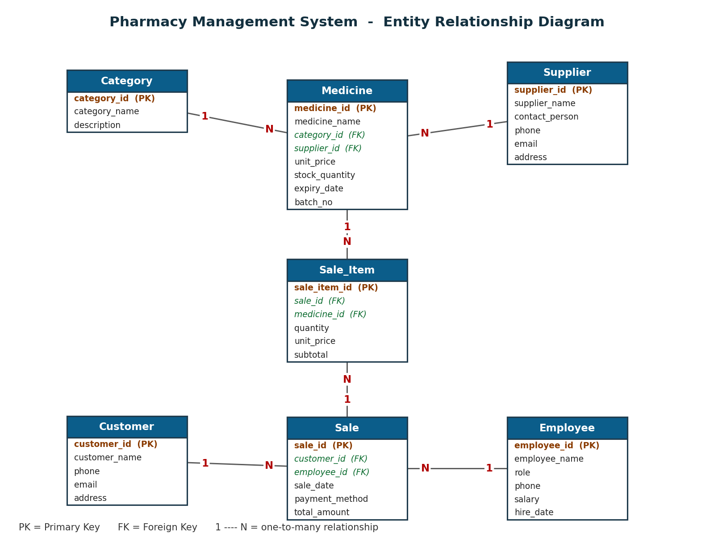

# Pharmacy Management System (DBMS Lab Project)

A desktop database application for a pharmacy, built with **Python (Tkinter)** for
the GUI and **SQLite** for the relational database. It fulfils every requirement of
the DBMS lab project: 7 normalized tables (3NF), 20+ records per table, primary and
foreign keys with proper data types, an ERD, DDL and DML, and a GUI that can add,
update, delete, search and report on the data.

## How to run

You only need Python 3 installed (`tkinter` and `sqlite3` ship with Python, so there
is nothing else to install to run the app).

```
python init_db.py     # builds pharmacy.db with all the sample data (run once)
python app.py         # starts the application
```

The database is also built automatically the first time you run `python app.py` if
`pharmacy.db` is missing.

To regenerate the documents (optional, only if you change the schema):

```
pip install python-docx matplotlib   # only needed for the two generators below
python generate_erd.py               # rebuilds report/ERD.png
python generate_report.py            # rebuilds the Word report
```

## Project files

| File | What it is |
|------|------------|
| `schema.sql` | **DDL** - creates the 7 tables with PKs, FKs, data types, constraints |
| `seed.sql` | **DML** - inserts 20+ records into every table |
| `queries.sql` | 20 demonstration queries (SELECT, JOIN, GROUP BY, subquery, UPDATE, DELETE, transaction) |
| `db.py` | Small SQLite helper used by the GUI |
| `init_db.py` | Builds (or rebuilds) `pharmacy.db` from `schema.sql` + `seed.sql` |
| `app.py` | The Tkinter GUI application |
| `generate_erd.py` | Draws `report/ERD.png` |
| `generate_report.py` | Builds the Word report |
| `pharmacy.db` | The SQLite database (generated) |
| `report/ERD.png` | The Entity Relationship Diagram |
| `report/Pharmacy_Management_System_Report.docx` | The full project report |

## Database design

Seven tables, normalized to 3NF:

1. **Category** - groups of medicines
2. **Supplier** - companies that supply medicines
3. **Medicine** - products in stock (FK to Category and Supplier)
4. **Customer** - people who buy medicines
5. **Employee** - staff who handle sales
6. **Sale** - one sales transaction / invoice header (FK to Customer and Employee)
7. **Sale_Item** - line items of a sale (FK to Sale and Medicine)

Relationships:

- Category `1 : N` Medicine
- Supplier `1 : N` Medicine
- Customer `1 : N` Sale
- Employee `1 : N` Sale
- Sale `1 : N` Sale_Item
- Medicine `1 : N` Sale_Item
- Sale `M : N` Medicine, resolved by the **Sale_Item** junction table



## GUI features

- A tab for each of the 7 tables with **Add, Update, Delete, Search** and a live
  record list (**View**).
- Foreign-key fields are dropdowns, so you pick a real Category/Supplier/Customer
  instead of typing an id.
- A **Reports** tab with 8 reports built from joins and aggregate queries:
  stock list, low stock, expiring soon, sales per customer, sales per employee,
  revenue per category, full invoices, and inventory valuation.
- Derived values are kept correct automatically: a Sale's `total_amount` is the sum
  of its `Sale_Item` subtotals, and a `Sale_Item` subtotal is `quantity x unit_price`.
- Constraints are enforced by the database (NOT NULL, UNIQUE, CHECK, FOREIGN KEY) and
  the app shows a clear message if a rule is broken.

## Before you submit

1. Open the Word report and fill in the placeholders on the title page:
   member names and student IDs, course, instructor, department/section, date.

The 6 GUI screenshots in section 7 are already captured and embedded (they also
live in `report/screenshots/`). If you would rather use your own, run
`python app.py` and replace them with **Win + Shift + S** captures.

## Viva preparation (likely questions and short answers)

- **Why SQLite?** It is a real relational database that uses standard SQL but stores
  everything in a single file, so it needs no server setup. Good for a project demo.
- **Primary key vs foreign key?** A primary key uniquely identifies each row in its
  table (e.g. `medicine_id`). A foreign key is a column that refers to the primary key
  of another table (e.g. `Medicine.category_id` refers to `Category.category_id`),
  which links the tables and enforces referential integrity.
- **DDL vs DML?** DDL (Data Definition Language) defines the structure:
  `CREATE TABLE`, constraints. DML (Data Manipulation Language) works with the data:
  `INSERT`, `UPDATE`, `DELETE`, `SELECT`.
- **Explain the normalization.** 1NF: every cell is atomic and there are no repeating
  groups (multiple medicines in a sale are separate `Sale_Item` rows, not a list). 2NF:
  every non-key column depends on the whole primary key (each table has a single-column
  key, so there are no partial dependencies). 3NF: no non-key column depends on another
  non-key column (Medicine stores `category_id`, not `category_name`, so there is no
  transitive dependency).
- **What is the many-to-many here and how is it resolved?** A sale can contain many
  medicines and a medicine can appear on many sales. This M:N relationship is resolved
  by the `Sale_Item` table, which has a foreign key to both `Sale` and `Medicine`.
- **How is referential integrity enforced?** Through foreign keys, with
  `PRAGMA foreign_keys = ON`. For example you cannot delete a Category that still has
  medicines, and deleting a Sale automatically removes its Sale_Items
  (`ON DELETE CASCADE`).
- **How is the sale total calculated?** It is a derived value:
  `total_amount = SUM(subtotal)` of the sale's line items, recomputed whenever the
  items change, so the data never becomes inconsistent.
